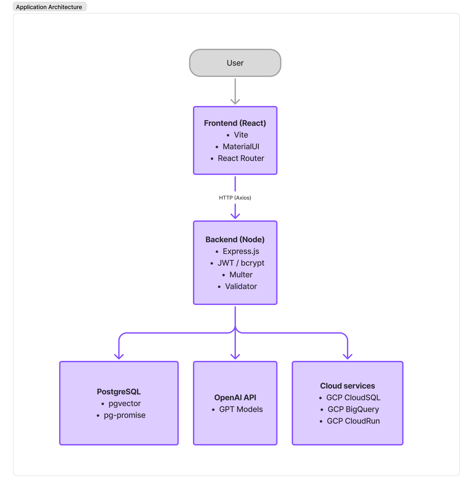
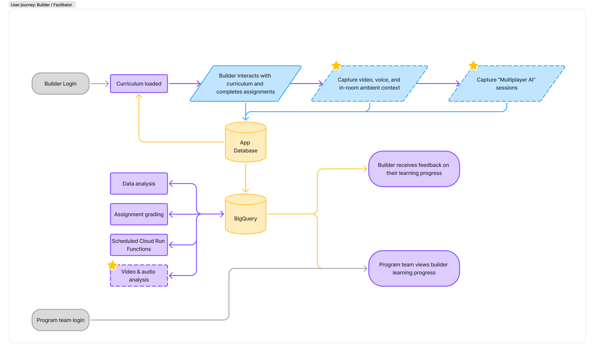

# Tech Stack & Architecture

## Application Architecture

The diagram above illustrates the high-level architecture of our application, showing how different components interact with each other.

## User Journey Flow

This diagram shows the builder/facilitator user journey and how they interact with the curriculum, assignments, and data analysis components.

## Tech Stack

### Backend (`test-pilot-server`)
- **Runtime**: Node.js with Express.js
- **Database**: PostgreSQL with pgvector extension
- **AI/ML**: OpenRouter API integration with vector embeddings
- **Authentication**: JWT with bcrypt
- **Additional Services**: Google Cloud BigQuery, AWS S3, Nodemailer

### Frontend (`pilot-client`) 
- **Framework**: React with Vite build tool
- **Routing**: React Router DOM
- **Styling**: Tailwind CSS with shadcn/ui components
- **UI Libraries**: Material-UI (MUI), Radix UI, Lucide React icons, React Big Calendar
- **State Management**: TanStack Query (React Query) for server state
- **Language**: JavaScript (ES6+)

## Database Architecture
- **PostgreSQL with pgvector**: Enables AI embedding storage and similarity search
- **Connection**: Configured in `db/dbConfig.js`
- **Mock Database**: Shared development environment (no local setup needed)

For a more detailed view of our database schema and entity relationships, see [database-erd.md](./images/database-erd.md).

## Cloud Services
- **GCP CloudSQL**: Managed PostgreSQL database
- **GCP BigQuery**: Data analytics and reporting
- **GCP CloudRun**: Serverless container execution
- **OpenRouter API**: AI model access for multiple LLM providers

## API Architecture
- All API endpoints use the `/api/` prefix
- RESTful naming conventions
- Proper HTTP status codes
- Consistent error handling
- JWT authentication for protected routes 